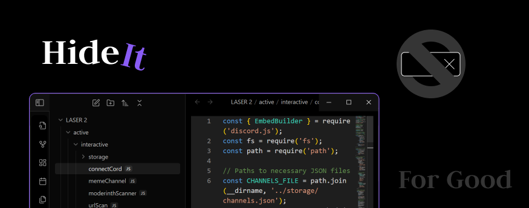

# **Hide It!**

**Hide It!** is a plugin designed to enhance the usability of Obsidian by allowing users to completely hide tabs from their UI for a cleaner, distraction-free workspace. Future updates will include additional customizable settings for hiding and managing buttons within the interface.

---

## **Features**
- Hide the tabs bar for a minimalist and focused workspace.
- Future versions will include more options to customize and hide interface elements.

---

## **How to Install**

### **Manual Installation**
1. In Obsidian, go to **Settings > Community Plugins** and make sure community plugins are enabled.
2. Download the plugin's folder or files from this repository.
3. Locate your Obsidian vault directory and navigate to the `.obsidian/plugins/` folder.
4. Place the downloaded `hide-it` folder into the `plugins` directory.
5. Go back to **Settings > Community Plugins** in Obsidian.
6. Locate **Hide It!** in the list of plugins and toggle it **on**.

---

## **How to Use**
1. Open the Obsidian **Settings** menu.
2. Navigate to **Community Plugins** and ensure the plugin is enabled.
3. Enjoy a cleaner workspace with hidden tabs!

---

**Stay tuned for future updates that bring more customization and usability improvements to your Obsidian workspace.**
